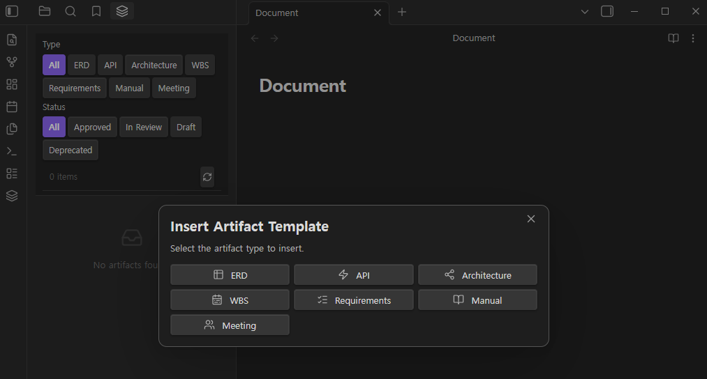
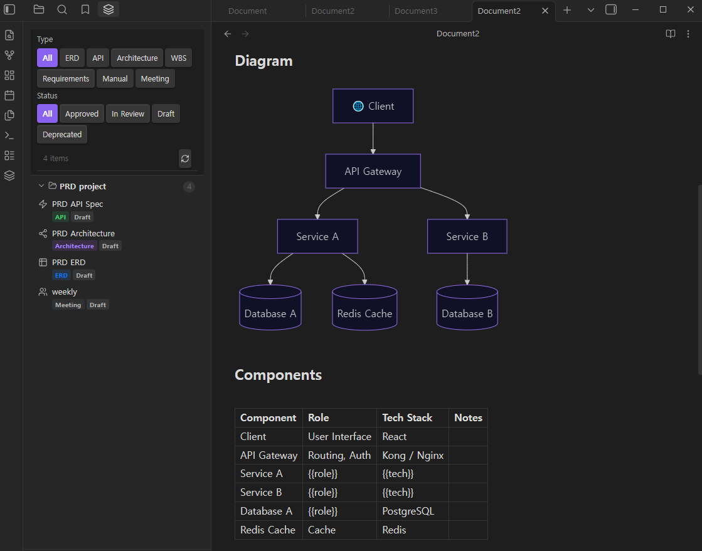
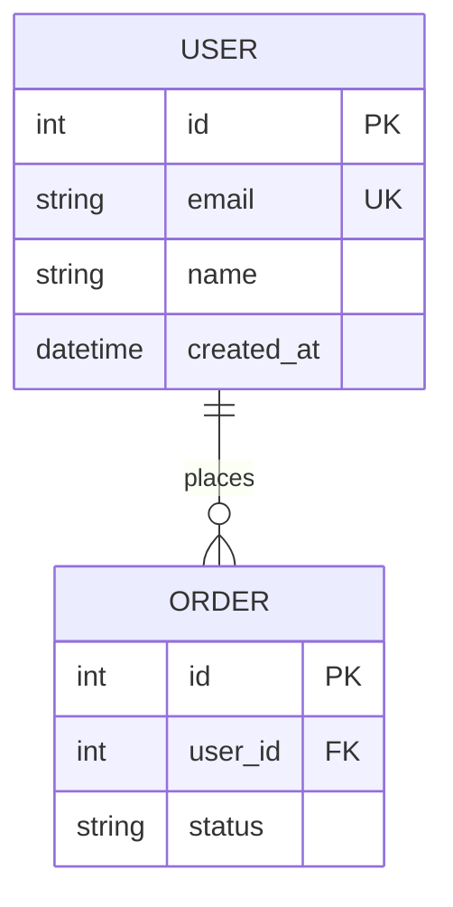

# DocFlow

**Render IT project artifacts with type-aware views inside Obsidian.**

DocFlow automatically detects the type of your IT documents — ERD, API specifications, WBS, architecture diagrams, requirements, manuals, and meeting notes — and renders them with purpose-built views, all within your Obsidian vault.

Supports **English and Korean** UI and templates out of the box.

---

## Screenshots



*Artifact Explorer (left) with type/status filters, and the Insert Artifact Template modal*



*Architecture diagram rendered from a Mermaid flowchart block, with the Artifact Explorer showing project artifacts grouped by project*

---

## Features

### ERD Renderer
Renders `erDiagram` Mermaid blocks as interactive entity-relationship diagrams.

- **Diagram view** with pinch-to-zoom and drag pan
- **Table view** — structured column list with PK / FK / UK badges
- **Export** to SVG or PNG with one click
- Auto-syncs with Obsidian's light / dark theme

### API Spec Renderer (Swagger UI)
Renders OpenAPI 3.x and Swagger 2.x specs written in `yaml` or `json` code blocks.

- Full Swagger UI embedded in the reading view
- Version badge (OAS 3 / OAS 2)
- **Try it out** mode — toggle in settings (off by default)

### Artifact Explorer (Left Sidebar)
Lists all IT artifact files in your vault in one panel.

- Filter by type (ERD, API, Architecture, WBS, Requirements, Manual, Meeting)
- Filter by status (Approved, In Review, Draft, Deprecated)
- Grouped by `project` frontmatter field
- Click any item to open the file

### Metadata Panel (Right Sidebar)
Shows frontmatter metadata for the currently open artifact file.

- Status badge with color coding (green / orange / gray / red)
- Version, author, last modified date
- Tag list
- Related document links — click to open

### Template Inserter
Insert a pre-filled artifact template from the command palette.

- Command: `DocFlow: Insert Artifact Template`
- Supports all 7 artifact types
- Prompts for title, project, author — leaves content placeholders for you to fill in
- Templates are provided in **English and Korean**

### Language Support
All UI labels, status badges, filter buttons, and artifact templates are fully localized.

- **Auto** — follows your system/browser locale
- **English** — always use English UI and templates
- **한국어** — always use Korean UI and templates

Change the language in **Settings → DocFlow → Language**. Command names update after re-enabling the plugin.

---

## Supported Artifact Types

| Type | Frontmatter `type` | Rendered As |
|------|-------------------|-------------|
| ERD | `erd` | Interactive ERD diagram + table |
| API Spec | `api` | Swagger UI |
| Architecture | `architecture` | Mermaid flowchart (passthrough) |
| WBS | `wbs` | Mermaid Gantt chart (passthrough) |
| Requirements | `requirements` | Structured markdown |
| Manual | `manual` | Structured markdown |
| Meeting Notes | `meeting` | Structured markdown |

---

## Installation

### From Community Plugins (Recommended)
1. Open Obsidian **Settings → Community Plugins → Browse**
2. Search for **DocFlow**
3. Click **Install**, then **Enable**

### Manual Installation
1. Download `main.js`, `manifest.json`, `styles.css` from the [latest release](https://github.com/GS-AX/docflow-obsidian/releases/latest)
2. Copy all three files to `<your-vault>/.obsidian/plugins/docflow/`
3. Reload Obsidian and enable the plugin under **Settings → Community Plugins**

---

## Usage

### Rendering an ERD

Create a markdown file with the following frontmatter and a `mermaid` code block:

~~~markdown
---
title: User Management ERD
type: erd
project: my-app
version: 1.0.0
status: approved
author: Your Name
tags: [database]
related: []
---


~~~

Switch between the **Diagram** and **Table** views using the tab buttons above the diagram. Export to PNG or SVG with the download button.

### Rendering an API Spec

~~~markdown
---
title: Auth API
type: api
project: my-app
version: 1.0.0
status: draft
author: Your Name
---

```yaml
openapi: 3.0.0
info:
  title: Auth API
  version: 1.0.0
paths:
  /login:
    post:
      summary: Login
      responses:
        '200':
          description: Success
```
~~~

### Inserting a Template

1. Open or create a new empty note
2. Open the command palette (`Ctrl+P` / `Cmd+P`)
3. Run **DocFlow: Insert Artifact Template**
4. Select an artifact type
5. Fill in the title, project, and author fields
6. Click **Insert Template**

The template language matches the current language setting (English or Korean).

### Auto-detection

If a file has no `type` in its frontmatter, DocFlow can detect the type automatically:

| Signal | Detected Type |
|--------|--------------|
| `erDiagram` keyword in a mermaid block | `erd` |
| `gantt` keyword in a mermaid block | `wbs` |
| `flowchart` / `graph` keyword in a mermaid block | `architecture` |
| File path contains `/api/` and ends in `.yaml` / `.json` | `api` |
| File path contains `/meeting` | `meeting` |

Auto-detection can be disabled in Settings if you prefer to set types explicitly.

---

## Frontmatter Fields

| Field | Type | Required | Default | Description |
|-------|------|----------|---------|-------------|
| `type` | string | **Yes** | — | Artifact type (`erd`, `api`, `architecture`, `wbs`, `requirements`, `manual`, `meeting`) |
| `title` | string | No | File name | Display title |
| `project` | string | No | — | Project name (used for grouping in the Explorer) |
| `version` | string | No | `1.0.0` | Semantic version |
| `status` | string | No | `draft` | `draft` \| `review` \| `approved` \| `deprecated` |
| `author` | string | No | — | Author name |
| `tags` | list | No | `[]` | Tag list |
| `related` | list | No | `[]` | Related files as wiki links, e.g. `[[auth-api]]` |

---

## Settings

| Setting | Default | Description |
|---------|---------|-------------|
| Language | Auto | UI language and template language. `Auto` follows your system locale · `English` · `한국어` |
| Auto Type Detection | ON | Detect artifact type from file content and path when `type` is not set in frontmatter |
| Swagger Try it out | OFF | Enable live HTTP requests in the API renderer |
| Diagram Theme | Auto | `Auto` follows Obsidian's theme · `Light` · `Dark` |
| Auto-open Metadata Panel | ON | Automatically open the metadata panel when entering Reading View for an artifact file |
| Scan Paths | (all) | Comma-separated folder paths to scan. Leave empty to scan the entire vault |

---

## Requirements

- Obsidian **1.4.0** or later
- Works on **desktop and mobile**

---

## License

[MIT](LICENSE)
