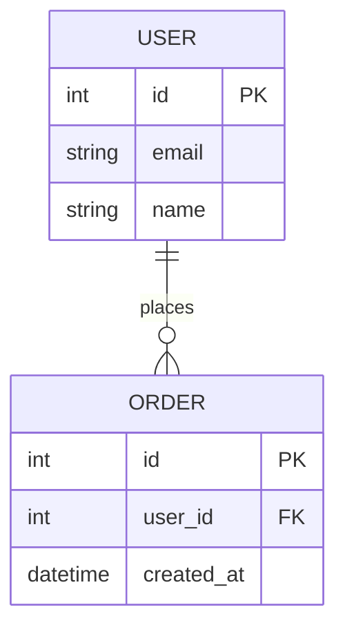

# PRD: DocFlow — Obsidian IT 산출물 관리 플러그인

**버전:** 2.0.0  
**작성일:** 2026-05-02  
**상태:** 초안 (Claude Code 구현용)  
**이전 버전:** prd-webapp-archived.md (Next.js 웹앱 버전)

---

## 1. 개요 (Overview)

### 1.1 전략적 배경

DocFlow는 IT 프로젝트 산출물(ERD, API 명세, 요구사항정의서, WBS, 업무 매뉴얼 등)을 마크다운으로 통합 관리하고, Git으로 버전을 추적하며, 산출물 유형별 최적화된 뷰로 열람하는 플랫폼이다.

**Phase 1 (현재):** Obsidian 커뮤니티 플러그인으로 빠르게 출시  
→ 100만+ 옵시디언 사용자 기반으로 초기 트랙션 확보, 핵심 기능 검증

**Phase 2 (추후):** 웹 뷰어 + 공유 링크 기능 추가  
→ 플러그인에서 "웹으로 퍼블리시" → DocFlow 서버로 전송

**Phase 3 (추후):** 독립 웹앱 병행  
→ 옵시디언 없이도 쓸 수 있는 전사 플랫폼

이 문서는 **Phase 1 — Obsidian 플러그인**의 PRD다.

### 1.2 목표

- Obsidian Vault를 IT 산출물 저장소로 활용
- 마크다운 frontmatter의 `type` 필드로 산출물 유형 자동 감지
- ERD, API 명세, WBS 등 IT 산출물을 옵시디언 내에서 최적화된 뷰로 렌더링
- 옵시디언 커뮤니티 플러그인 스토어 등록 및 승인

### 1.3 타겟 사용자

| 사용자 | 사용 패턴 |
|--------|---------|
| 개발자 / 엔지니어 | ERD, API 명세, 아키텍처 다이어그램을 옵시디언에서 바로 확인 |
| PM / 기획자 | WBS, 요구사항정의서, 회의록을 옵시디언 볼트로 관리 |
| 개인 IT 지식 관리 | 기술 문서, 학습 노트를 구조화된 뷰로 열람 |

### 1.4 옵시디언 플러그인 선택 이유

- **즉시 사용자 기반**: 커뮤니티 플러그인 스토어 노출만으로 초기 마케팅 해결
- **저장소 문제 해결**: Vault가 곧 마크다운 저장소 — 파일 관리 인프라 불필요
- **Git 연동 기존재**: obsidian-git 플러그인과 자연스럽게 연동
- **개발 속도**: 서버/인프라 없이 TypeScript 플러그인만 개발
- **검증 비용 최소화**: 실제 사용자 피드백으로 핵심 기능 빠르게 검증

---

## 2. 옵시디언 플러그인 기술 기반

### 2.1 플러그인 아키텍처

```
Obsidian App
├── Vault (마크다운 파일 저장소)
│     └── .obsidian/plugins/docflow/   ← 플러그인 설치 위치
│
├── Plugin API
│     ├── MarkdownPostProcessor       ← 마크다운 렌더링 후처리
│     ├── MarkdownView                ← 편집/미리보기 뷰
│     ├── ItemView                    ← 커스텀 사이드패널 뷰
│     ├── Modal                       ← 팝업 다이얼로그
│     └── MetadataCache               ← frontmatter 파싱 캐시
│
└── DocFlow Plugin
      ├── main.ts                     ← 플러그인 진입점
      ├── renderers/                  ← 산출물 유형별 렌더러
      ├── views/                      ← 커스텀 사이드패널 뷰
      └── settings/                   ← 플러그인 설정
```

### 2.2 기술 스택

| 항목 | 기술 | 비고 |
|------|------|------|
| 언어 | TypeScript | 옵시디언 플러그인 표준 |
| 빌드 | esbuild | 옵시디언 공식 템플릿 사용 |
| 다이어그램 | Mermaid.js | ERD, Flowchart, Gantt |
| API 렌더링 | swagger-ui-dist | OpenAPI 3.0, 번들 포함 버전 |
| 스타일 | CSS Variables | 옵시디언 테마 자동 연동 |
| 테스트 | Jest | 유닛 테스트 |

### 2.3 스토어 등록 요건

커뮤니티 플러그인 스토어 등록을 위해 반드시 충족해야 하는 조건이다.

- `manifest.json` 필수 필드 완비 (id, name, version, minAppVersion 등)
- `main.js`, `manifest.json`, `styles.css` 빌드 결과물 GitHub Release에 첨부
- `obsidian-releases` 저장소에 PR 제출 및 코드 리뷰 통과
- 외부 네트워크 요청 최소화 또는 명시적 사용자 동의
- `eval()` 미사용, 민감 정보 하드코딩 없음

---

## 3. 산출물 유형 및 렌더링 전략

### 3.1 frontmatter 기반 유형 감지

```yaml
---
title: 회원 관리 시스템 ERD
type: erd
project: user-management
version: 1.3.0
status: approved      # draft | review | approved | deprecated
author: 홍길동
tags: [database, user, auth]
related:
  - "[[auth-api]]"
  - "[[user-requirements]]"
---
```

### 3.2 지원 산출물 유형

| type | 산출물 | 렌더링 방식 | 우선순위 |
|------|--------|-----------|---------|
| `erd` | ERD | Mermaid erDiagram → 인터랙티브 다이어그램 | **P1** |
| `api` | API 명세 | OpenAPI 3.0 → Swagger UI | **P1** |
| `architecture` | 시스템 아키텍처 | Mermaid flowchart / C4Context | **P1** |
| `wbs` | WBS / 일정 | Mermaid gantt + 테이블 전환 | P2 |
| `requirements` | 요구사항정의서 | 필터/정렬 인터랙티브 테이블 | P2 |
| `manual` | 업무 매뉴얼 | 자동 목차 + 프린트 최적화 | P2 |
| `meeting` | 회의록 | 타임라인 + 액션 아이템 추출 | P2 |

### 3.3 type 자동 감지 규칙

frontmatter에 `type`이 없을 경우 본문 내용으로 감지한다.

1. 본문에 mermaid 블록 + `erDiagram` 포함 → `erd`
2. 본문에 mermaid 블록 + `gantt` 포함 → `wbs`
3. 본문에 mermaid 블록 + `flowchart` / `graph` 포함 → `architecture`
4. 파일 경로에 `/api/` 포함 + `.yaml` / `.json` → `api`
5. 파일 경로에 `/meeting` 포함 → `meeting`
6. 그 외 → 기본 옵시디언 렌더링 (플러그인 미개입)

---

### 3.4 산출물 유형별 마크다운 포맷 정의

각 산출물 유형의 표준 작성 포맷이다. DocFlow는 이 포맷을 기반으로 렌더링하며, `DocFlow: 산출물 템플릿 삽입` 커맨드로 자동 생성된다.

#### 공통 설계 원칙

- **frontmatter는 공통 구조**: `type`, `status`, `version`, `author`, `related`는 모든 산출물이 공유
- **렌더링 트리거는 코드블록**: ERD/API/WBS는 mermaid 또는 yaml 코드블록이 렌더러를 활성화
- **본문은 자유 마크다운**: 코드블록 외 나머지는 일반 마크다운으로 자유 작성

#### 공통 frontmatter 필드

| 필드 | 필수 여부 | 설명 |
|------|---------|------|
| `title` | 필수 | 문서 제목 |
| `type` | 필수 | 산출물 유형 (렌더러 결정) |
| `project` | 권장 | 프로젝트명 (탐색 뷰 그룹핑 기준) |
| `version` | 권장 | 문서 버전 (semver 권장) |
| `status` | 권장 | draft / review / approved / deprecated |
| `author` | 권장 | 작성자 |
| `tags` | 선택 | 태그 배열 |
| `related` | 선택 | 연관 문서 Wiki 링크 배열 |

---

#### 포맷 1 — ERD (`type: erd`)

```markdown
---
title: 회원 관리 시스템 ERD
type: erd
project: user-management
version: 1.2.0
status: approved
author: 홍길동
tags: [database, user, auth]
related:
  - "[[auth-api]]"
  - "[[user-requirements]]"
---

## 개요

회원, 주문, 상품 간의 관계를 정의한다.

## 다이어그램

\`\`\`mermaid
erDiagram
  USER {
    int id PK
    string email UK
    string name
    datetime created_at
  }
  ORDER {
    int id PK
    int user_id FK
    string status
    datetime ordered_at
  }
  USER ||--o{ ORDER : "places"
\`\`\`

## 테이블 설명

### USER
| 컬럼 | 타입 | 설명 |
|------|------|------|
| id | INT | PK, Auto Increment |
| email | VARCHAR(255) | 유니크, 로그인 ID |
| name | VARCHAR(100) | 사용자 이름 |

## 변경 이력

| 버전 | 날짜 | 변경 내용 |
|------|------|---------|
| 1.2.0 | 2026-04-01 | ORDER 테이블 status 컬럼 추가 |
| 1.0.0 | 2026-01-15 | 최초 작성 |
```

**렌더러 동작:** mermaid 블록 내 `erDiagram` 감지 → Mermaid.js 다이어그램 + 테이블 뷰 전환 버튼 표시

---

#### 포맷 2 — API 명세 (`type: api`)

```markdown
---
title: 인증 API 명세
type: api
project: user-management
version: 2.0.0
status: approved
author: 김철수
tags: [auth, jwt, rest]
related:
  - "[[user-erd]]"
  - "[[auth-flow]]"
---

## 개요

JWT 기반 인증 API. 로그인, 토큰 갱신, 로그아웃을 제공한다.

## 명세

\`\`\`yaml
openapi: 3.0.0
info:
  title: Auth API
  version: 2.0.0

paths:
  /auth/login:
    post:
      summary: 로그인
      requestBody:
        required: true
        content:
          application/json:
            schema:
              type: object
              properties:
                email:
                  type: string
                password:
                  type: string
      responses:
        '200':
          description: 로그인 성공
          content:
            application/json:
              schema:
                type: object
                properties:
                  token:
                    type: string
        '401':
          description: 인증 실패
\`\`\`

## 변경 이력

| 버전 | 날짜 | 변경 내용 |
|------|------|---------|
| 2.0.0 | 2026-03-01 | JWT → Refresh Token 방식 전환 |
| 1.0.0 | 2026-01-01 | 최초 작성 |
```

**렌더러 동작:** `type: api` + yaml 코드블록 감지 → Swagger UI 렌더링

---

#### 포맷 3 — 시스템 아키텍처 (`type: architecture`)

```markdown
---
title: 전체 시스템 아키텍처
type: architecture
project: user-management
version: 1.0.0
status: approved
author: 이영희
tags: [architecture, msa, infra]
related:
  - "[[user-erd]]"
  - "[[auth-api]]"
---

## 개요

마이크로서비스 기반 전체 시스템 구성도.

## 다이어그램

\`\`\`mermaid
flowchart TD
  Client["🌐 Client (Browser)"]
  Gateway["API Gateway"]
  AuthSvc["Auth Service"]
  UserSvc["User Service"]
  OrderSvc["Order Service"]
  DB1[("Auth DB")]
  DB2[("User DB")]
  DB3[("Order DB")]

  Client --> Gateway
  Gateway --> AuthSvc
  Gateway --> UserSvc
  Gateway --> OrderSvc
  AuthSvc --> DB1
  UserSvc --> DB2
  OrderSvc --> DB3
\`\`\`

## 컴포넌트 설명

| 컴포넌트 | 역할 | 기술 스택 |
|---------|------|---------|
| API Gateway | 라우팅, 인증 검증 | Kong |
| Auth Service | JWT 발급/검증 | Node.js |
| User Service | 회원 CRUD | Spring Boot |
| Order Service | 주문 처리 | Spring Boot |
```

**렌더러 동작:** mermaid 블록 내 `flowchart` / `graph` 감지 → 확대 모달 + PNG/SVG 내보내기 버튼 표시

---

#### 포맷 4 — WBS / 일정 (`type: wbs`) — Phase 2

```markdown
---
title: 회원 관리 시스템 개발 일정
type: wbs
project: user-management
version: 1.0.0
status: draft
author: 홍길동
---

## 전체 일정

\`\`\`mermaid
gantt
  title 회원 관리 시스템 개발 일정
  dateFormat YYYY-MM-DD
  section 기획
    요구사항 정의   :done,    2026-01-01, 2026-01-14
    UI 설계         :done,    2026-01-15, 2026-01-28
  section 개발
    백엔드 API      :active,  2026-02-01, 2026-03-15
    프론트엔드      :         2026-03-01, 2026-04-15
  section QA
    테스트          :         2026-04-16, 2026-04-30
\`\`\`

## 마일스톤

| 마일스톤 | 목표일 | 상태 |
|---------|-------|------|
| 기획 완료 | 2026-01-28 | ✅ 완료 |
| 개발 완료 | 2026-04-15 | 🔄 진행중 |
| 출시 | 2026-04-30 | ⏳ 대기 |
```

**렌더러 동작:** mermaid 블록 내 `gantt` 감지 → Gantt 차트 + 테이블 뷰 전환 버튼 표시

---

#### 포맷 5 — 요구사항정의서 (`type: requirements`) — Phase 2

```markdown
---
title: 회원 관리 시스템 요구사항정의서
type: requirements
project: user-management
version: 1.1.0
status: approved
author: 홍길동
---

## 기능 요구사항

| ID | 분류 | 요구사항 | 우선순위 | 상태 |
|----|------|---------|---------|------|
| F-001 | 인증 | 이메일/비밀번호로 로그인 | 필수 | 완료 |
| F-002 | 인증 | JWT 토큰 자동 갱신 | 필수 | 진행중 |
| F-003 | 회원 | 회원 정보 수정 | 보통 | 대기 |
| F-004 | 회원 | 회원 탈퇴 처리 | 보통 | 대기 |

## 비기능 요구사항

| ID | 항목 | 요구사항 |
|----|------|---------|
| N-001 | 성능 | 로그인 응답 500ms 이내 |
| N-002 | 보안 | 비밀번호 bcrypt 암호화 |
```

**렌더러 동작:** `type: requirements` 감지 → 마크다운 테이블을 필터/정렬 가능한 인터랙티브 테이블로 변환

---

#### 포맷 6 — 회의록 (`type: meeting`) — Phase 2

```markdown
---
title: 킥오프 회의록
type: meeting
project: user-management
date: 2026-04-01
attendees: [홍길동, 김철수, 이영희]
status: approved
---

## 안건

1. 프로젝트 일정 확정
2. 역할 분담
3. 개발 환경 결정

## 논의 내용

### 1. 프로젝트 일정
- 기획 완료 목표: 1월 말
- 개발 완료 목표: 4월 중순

### 2. 역할 분담
- 홍길동: PM, 요구사항 관리
- 김철수: 백엔드 개발
- 이영희: 프론트엔드 개발

## 액션 아이템

- [ ] 홍길동: 요구사항정의서 초안 작성 (~ 4/7)
- [ ] 김철수: 개발환경 세팅 (~ 4/5)
- [ ] 이영희: 디자인 시안 작성 (~ 4/10)
```

**렌더러 동작:** `type: meeting` 감지 → 날짜 타임라인 뷰 + `- [ ]` 액션 아이템 자동 추출 패널 표시

---

#### 포맷 7 — 업무 매뉴얼 (`type: manual`) — Phase 2

```markdown
---
title: 서버 배포 운영 매뉴얼
type: manual
project: user-management
version: 1.0.0
status: approved
author: 이영희
tags: [deploy, ops, infra]
---

## 목차
<!-- DocFlow가 H2/H3 헤딩 기반으로 자동 생성 -->

## 1. 배포 절차

### 1.1 사전 확인 사항
배포 전 아래 항목을 반드시 확인한다.
- 스테이징 환경 테스트 통과 여부
- DB 마이그레이션 스크립트 준비 여부

### 1.2 배포 실행
\`\`\`bash
./deploy.sh production
\`\`\`

## 2. 장애 대응

### 2.1 서버 다운 시
1. 모니터링 알림 확인
2. 로그 확인: \`tail -f /var/log/app.log\`
3. 서비스 재시작: \`systemctl restart app\`
```

**렌더러 동작:** `type: manual` 감지 → H2/H3 헤딩 기반 자동 목차(TOC) 생성 + 프린트 최적화 뷰 제공

---

## 4. 핵심 기능 명세

### 4.1 IT 산출물 렌더러 (P1 — MVP 핵심)

#### ERD 렌더러

- Reading View에서 mermaid 블록 내 `erDiagram` 감지 시 자동 활성화
- Mermaid.js로 인터랙티브 다이어그램 렌더링
- 다이어그램 뷰 / 테이블 뷰 탭 전환
- PNG / SVG 다운로드 버튼
- 줌 인/아웃, 드래그 이동

**예시:**
```markdown
---
type: erd
title: 회원 관리 ERD
status: approved
---


```

#### API 명세 렌더러

- frontmatter `type: api` 감지 시 활성화
- 파일 본문의 YAML/JSON 코드블록을 OpenAPI 3.0으로 파싱
- Swagger UI로 렌더링
- Try it out 기능은 설정에서 on/off
- 옵시디언 다크/라이트 테마 자동 대응
- 지원 형식: OpenAPI 3.0, Swagger 2.0

#### 아키텍처 다이어그램 렌더러

- flowchart, graph, C4Context Mermaid 블록 → 전체 화면 뷰 지원
- 다이어그램 클릭 시 확대 모달
- PNG/SVG 내보내기

---

### 4.2 문서 메타데이터 패널 (P1)

**위치:** Reading View 우측 사이드 패널

**표시 정보:**
- 문서 상태 뱃지 (draft / review / approved / deprecated)
- 버전, 작성자, 최종 수정일
- 태그 목록
- 연관 문서 링크 (related 필드 → 클릭 시 해당 파일 열기)

**상태 뱃지 색상:**

| 상태 | 색상 |
|------|------|
| draft | 회색 |
| review | 주황 |
| approved | 초록 |
| deprecated | 빨강 |

---

### 4.3 산출물 탐색 뷰 (P1)

**위치:** 좌측 사이드바 리본 아이콘 → DocFlow 패널

**기능:**
- 볼트 내 IT 산출물 목록 (frontmatter type 있는 파일만)
- 유형별 / 상태별 필터링
- 프로젝트별 그룹핑 (frontmatter project 필드 기준)
- 클릭 시 해당 파일 열기

---

### 4.4 frontmatter 템플릿 삽입 (P1)

커맨드 팔레트: `DocFlow: 산출물 템플릿 삽입`

지원 템플릿: ERD, API 명세, WBS, 요구사항정의서, 회의록, 업무 매뉴얼

각 템플릿은 해당 유형에 맞는 frontmatter + 마크다운 기본 구조를 자동 삽입한다.

---

### 4.5 연관관계 그래프 강화 (P2)

- frontmatter `related` 필드 연결도 기본 그래프에 반영
- 노드 색상을 산출물 유형별 구분 (ERD=파랑, API=초록, WBS=주황)
- IT 산출물만 표시 / 전체 표시 토글

---

### 4.6 전문 검색 강화 (P2)

- `type:erd`, `status:approved`, `project:user-management` 검색 연산자 추가
- 검색 결과에 산출물 유형 뱃지 표시
- 한국어 검색 품질 개선

---

### 4.7 obsidian-git 연동 (P2)

obsidian-git 플러그인이 설치된 경우에만 동작한다.

- 현재 파일의 Git 커밋 이력 사이드패널 표시
- 특정 커밋 시점의 파일 내용 조회 (읽기 전용)
- 마지막 커밋 이후 변경 여부 파일 탐색기 아이콘 표시

---

## 5. 플러그인 설정

옵시디언 설정 → Community Plugins → DocFlow

| 설정 항목 | 기본값 | 설명 |
|---------|-------|------|
| 자동 유형 감지 | ON | frontmatter type 없어도 본문 분석으로 감지 |
| Swagger Try it out | OFF | API 렌더러 직접 호출 기능 |
| 메타데이터 패널 자동 표시 | ON | Reading View 진입 시 우측 패널 자동 열기 |
| 다이어그램 테마 | auto | light / dark / auto (옵시디언 테마 따라감) |
| 산출물 스캔 경로 | (전체) | 특정 폴더만 스캔하도록 제한 (선택) |

---

## 6. 폴더 구조

```
docflow-obsidian/
├── src/
│   ├── main.ts                     # 플러그인 진입점
│   ├── settings.ts                 # 설정 탭
│   ├── types.ts                    # 공통 타입 정의
│   │
│   ├── renderers/
│   │   ├── index.ts                # 렌더러 라우터 (type → renderer)
│   │   ├── ErdRenderer.ts
│   │   ├── ApiRenderer.ts
│   │   ├── ArchitectureRenderer.ts
│   │   ├── WbsRenderer.ts
│   │   ├── RequirementsRenderer.ts
│   │   ├── ManualRenderer.ts
│   │   └── MeetingRenderer.ts
│   │
│   ├── views/
│   │   ├── ArtifactExplorerView.ts # 좌측 사이드바 탐색 패널
│   │   └── MetadataPanelView.ts    # 우측 메타데이터 패널
│   │
│   └── utils/
│       ├── frontmatter.ts          # frontmatter 파싱
│       ├── typeDetector.ts         # 유형 자동 감지
│       └── templateInserter.ts     # 템플릿 삽입
│
├── styles.css
├── manifest.json
├── package.json
├── esbuild.config.mjs
├── tsconfig.json
└── README.md
```

---

## 7. manifest.json

```json
{
  "id": "docflow",
  "name": "DocFlow — IT Artifact Renderer",
  "version": "1.0.0",
  "minAppVersion": "1.4.0",
  "description": "Render IT artifacts (ERD, API specs, WBS, requirements) with type-aware views. Built for developers and IT teams managing project documents in Obsidian.",
  "author": "DocFlow Team",
  "authorUrl": "https://github.com/your-org/docflow-obsidian",
  "fundingUrl": "https://github.com/sponsors/your-org",
  "isDesktopOnly": false
}
```

---

## 8. 구현 로드맵

### Phase 1 — MVP (1~4주차)
목표: 핵심 렌더러 3종 + 스토어 등록

- [ ] obsidian-sample-plugin 템플릿 기반 프로젝트 세팅
- [ ] frontmatter 파싱 및 type 자동 감지
- [ ] ERD 렌더러 (Mermaid erDiagram)
- [ ] API 명세 렌더러 (Swagger UI)
- [ ] 아키텍처 다이어그램 렌더러 (Mermaid flowchart)
- [ ] 문서 메타데이터 패널 (상태 뱃지, 연관 문서)
- [ ] 산출물 탐색 뷰 (사이드바)
- [ ] frontmatter 템플릿 자동 삽입 커맨드
- [ ] 플러그인 설정 탭
- [ ] 다크/라이트 테마 대응
- [ ] manifest.json + GitHub Release
- [ ] obsidian-releases PR 제출

**완료 기준:** 옵시디언에서 ERD/API/아키텍처 문서를 열면 자동으로 최적화된 뷰로 렌더링됨

---

### Phase 2 — 기능 확장 (5~8주차)

- [ ] WBS / Gantt 렌더러
- [ ] 요구사항정의서 인터랙티브 테이블 렌더러
- [ ] 회의록 타임라인 렌더러
- [ ] 업무 매뉴얼 TOC 렌더러
- [ ] 연관관계 그래프 강화
- [ ] 전문 검색 연산자
- [ ] obsidian-git 연동
- [ ] 한국어 검색 품질 개선

---

### Phase 3 — 웹 연동 (9주차~)

- [ ] "웹으로 퍼블리시" 기능 (선택 문서 → DocFlow 웹 서버 전송)
- [ ] 공유 링크 생성 (외부 Guest 접근)
- [ ] 독립 웹앱 연동 (prd-webapp-archived.md 참조)

---

## 9. 옵시디언 플러그인 스토어 배포 가이드

### 9.1 배포 전체 흐름

```
개발 완료
    ↓
GitHub Release 생성 (main.js + manifest.json + styles.css 첨부)
    ↓
obsidian-releases PR 제출
    ↓
옵시디언 팀 코드 리뷰 (보통 2~8주)
    ↓
PR 머지 → 커뮤니티 플러그인 스토어 자동 노출
```

> 심사 중에도 GitHub에서 직접 설치해 베타 테스트 가능

---

### 9.2 필수 파일 3개

GitHub 저장소 루트에 반드시 있어야 한다.

```
docflow-obsidian/
├── main.js          ← 빌드된 플러그인 코드 (esbuild 결과물)
├── manifest.json    ← 플러그인 메타데이터
└── styles.css       ← 스타일 (내용 없어도 파일은 존재해야 함)
```

**manifest.json 필수 필드:**
```json
{
  "id": "docflow",
  "name": "DocFlow",
  "version": "1.0.0",
  "minAppVersion": "1.4.0",
  "description": "IT artifact renderer for Obsidian",
  "author": "Your Name",
  "authorUrl": "https://github.com/your-id",
  "isDesktopOnly": false
}
```

> `id`는 스토어 전체에서 유일해야 한다.
> 반드시 [community-plugins.json](https://github.com/obsidianmd/obsidian-releases/blob/master/community-plugins.json)에서 중복 확인 후 사용할 것.

---

### 9.3 GitHub Release 생성

```bash
# 1. 버전 태그 생성
git tag 1.0.0
git push origin 1.0.0

# 2. GitHub → Releases → Create new release
# Tag: 1.0.0
# Assets에 main.js, manifest.json, styles.css 직접 첨부
```

---

### 9.4 obsidian-releases PR 제출

```bash
# 1. 공식 저장소 Fork
# https://github.com/obsidianmd/obsidian-releases

# 2. community-plugins.json 배열에 아래 항목 추가
{
  "id": "docflow",
  "name": "DocFlow",
  "author": "Your Name",
  "description": "IT artifact renderer for Obsidian",
  "repo": "your-github-id/docflow-obsidian"
}

# 3. PR 제출 (제목 예시: "Add DocFlow plugin")
```

---

### 9.5 코드 리뷰 통과 기준

PR이 자주 반려되는 주요 원인과 대응 방법이다.

**🚨 보안 (가장 엄격)**

| 항목 | 기준 |
|------|------|
| `eval()` | 절대 사용 금지 — 즉시 반려 |
| `innerHTML` 직접 사용 | XSS 방지 처리 필수 (DOMPurify 등) |
| 외부 네트워크 요청 | 사용자에게 명시적 고지 필요 |
| 민감 정보 하드코딩 | API Key, 토큰 등 절대 금지 |

**코드 품질**

| 항목 | 기준 |
|------|------|
| `console.log` | 프로덕션 코드에서 제거 |
| `onunload()` | 모든 이벤트 리스너, DOM 변경 완전히 원복 필수 |
| 에러 처리 | 콘솔 에러만 내뱉으면 안 됨 — 사용자 친화적 메시지 필요 |

> `onunload()` cleanup 누락이 `eval()` 사용과 함께 가장 흔한 반려 사유다.
> Claude Code 구현 시 처음부터 `onunload()`에 cleanup 로직을 작성할 것.

**UX**

| 항목 | 기준 |
|------|------|
| 테마 대응 | 다크/라이트 테마 모두 정상 동작 |
| 설정 텍스트 | 각 설정 항목에 명확한 설명 문구 |
| 플러그인 비활성화 | 비활성화 시 완전히 원복됨 확인 |

**README (영문 필수)**

| 항목 | 기준 |
|------|------|
| 기능 설명 | 플러그인이 무엇을 하는지 명확히 |
| 사용 방법 | 설치 후 사용 방법 단계별 설명 |
| 스크린샷 | 주요 기능 스크린샷 1장 이상 |
| 모바일 지원 여부 | 명시 필수 (`isDesktopOnly` 값과 일치) |

---

### 9.6 베타 테스트 (심사 전)

스토어 등록 전 팀 내부 테스트 방법이다.

```
# 옵시디언 볼트 내 경로에 직접 복사
{vault}/.obsidian/plugins/docflow/
├── main.js
├── manifest.json
└── styles.css

# 이후 옵시디언 재시작
# Settings → Community Plugins → docflow 활성화
```

---

### 9.7 스토어 등록 최종 체크리스트

**파일 구성**
- [ ] `manifest.json` 필수 필드 완비, id 중복 없음 확인
- [ ] `main.js` (esbuild 빌드 결과물)
- [ ] `styles.css` (빈 파일이라도 존재)
- [ ] `README.md` (영문, 스크린샷 포함)
- [ ] GitHub Release에 위 3개 파일 Asset으로 첨부

**코드 품질**
- [ ] `eval()` 미사용 전수 확인
- [ ] `innerHTML` 사용 시 XSS 처리 확인
- [ ] `console.log` 전부 제거
- [ ] `onunload()` cleanup 로직 완비
- [ ] 외부 네트워크 요청 없음 또는 사용자 고지 처리

**UX**
- [ ] 다크/라이트 테마 모두 테스트 완료
- [ ] 플러그인 비활성화 후 완전 원복 확인
- [ ] 설정 항목 설명 텍스트 완비
- [ ] 에러 상황 사용자 친화적 메시지 확인

**PR 제출**
- [ ] `obsidian-releases` 저장소 Fork
- [ ] `community-plugins.json`에 항목 추가
- [ ] PR 설명에 기능 설명 + 스크린샷 첨부

---

### 9.8 공식 참고 문서

- 플러그인 개발 가이드: `https://docs.obsidian.md/Plugins/Getting+started/Build+a+plugin`
- 샘플 플러그인 템플릿: `https://github.com/obsidianmd/obsidian-sample-plugin`
- 스토어 등록 저장소: `https://github.com/obsidianmd/obsidian-releases`
- community-plugins.json (id 중복 확인): `https://github.com/obsidianmd/obsidian-releases/blob/master/community-plugins.json`

---

## 10. Claude Code 시작 명령어

```bash
# 1. 옵시디언 샘플 플러그인 템플릿 클론
git clone https://github.com/obsidianmd/obsidian-sample-plugin.git docflow-obsidian
cd docflow-obsidian

# 2. Claude Code 실행
claude

# 프롬프트 예시
> prd.md를 읽고 DocFlow Obsidian 플러그인을 구현해줘.
> Phase 1 MVP 기준으로, ERD 렌더러부터 시작해줘.
> obsidian-sample-plugin 구조를 기반으로 TypeScript로 작성해.
```

---

## 11. 용어 정의

| 용어 | 정의 |
|------|------|
| Vault | 옵시디언의 마크다운 파일 저장소 (폴더 단위) |
| frontmatter | 마크다운 파일 최상단 YAML 메타데이터 (`---`로 구분) |
| Reading View | 옵시디언의 렌더링된 미리보기 뷰 |
| MarkdownPostProcessor | 마크다운 렌더링 후 DOM을 조작하는 옵시디언 API |
| ItemView | 옵시디언 사이드패널에 커스텀 뷰를 추가하는 API |
| obsidian-releases | 커뮤니티 플러그인 등록을 관리하는 공식 GitHub 저장소 |

---

*Phase 3 웹 연동 구현 시 prd-webapp-archived.md를 참조하여 확장한다.*
