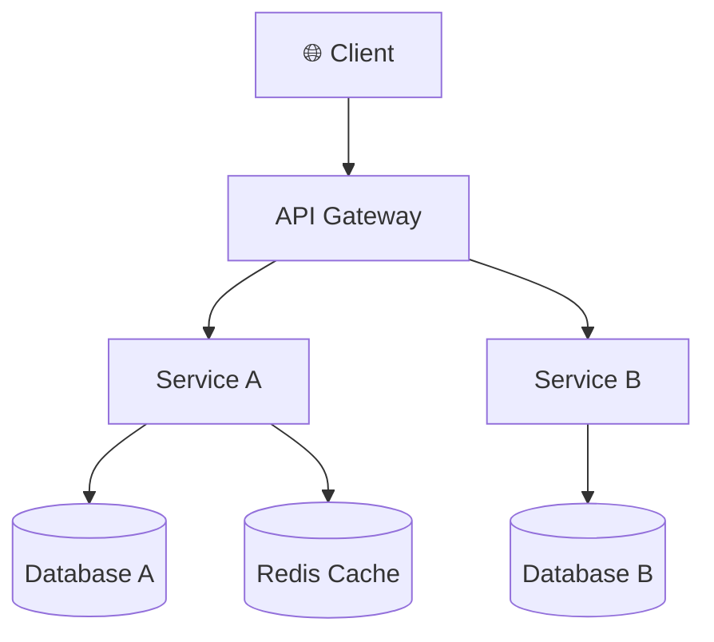

## Overview

{{architecture description}}

## Diagram

## Components

| Component | Role | Tech Stack | Notes |
|-----------|------|------------|-------|
| Client | User Interface | React | |
| API Gateway | Routing, Auth | Kong / Nginx | |
| Service A | {{role}} | {{tech}} | |
| Service B | {{role}} | {{tech}} | |
| Database A | {{role}} | PostgreSQL | |
| Redis Cache | Cache | Redis | |

## Infrastructure

| Item | Dev | Staging | Prod |
|------|-----|---------|------|
| Server | Docker local | AWS ECS | AWS ECS |
| DB | PostgreSQL (local) | RDS | RDS (Multi-AZ) |
| CDN | - | - | CloudFront |

## Change History

| Version | Date | Changes | Author |
|---------|------|---------|--------|
| 1.0.0 | {{date}} | Initial revision | {{author}} |
