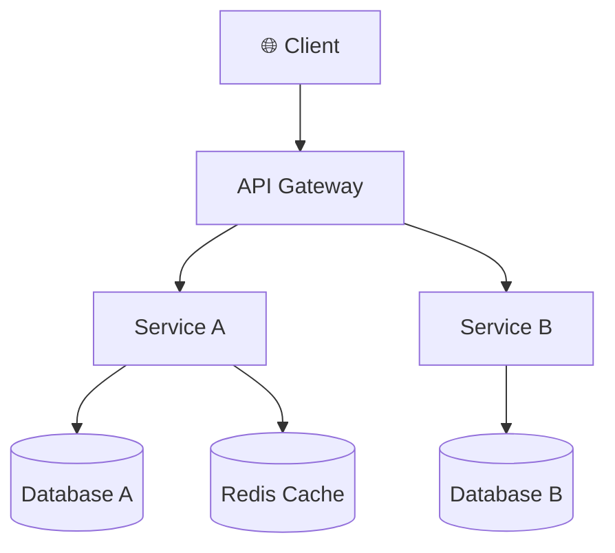

## 개요

{{아키텍처 설명}}

## 다이어그램

## 컴포넌트 설명

| 컴포넌트 | 역할 | 기술 스택 | 비고 |
|---------|------|---------|------|
| Client | 사용자 인터페이스 | React | |
| API Gateway | 라우팅, 인증 | Kong / Nginx | |
| Service A | {{역할}} | {{기술}} | |
| Service B | {{역할}} | {{기술}} | |
| Database A | {{역할}} | PostgreSQL | |
| Redis Cache | 캐시 | Redis | |

## 인프라 구성

| 항목 | 개발 | 스테이징 | 운영 |
|------|------|---------|------|
| 서버 | Docker local | AWS ECS | AWS ECS |
| DB | PostgreSQL (local) | RDS | RDS (Multi-AZ) |
| CDN | - | - | CloudFront |

## 변경 이력

| 버전 | 날짜 | 변경 내용 | 작성자 |
|------|------|---------|-------|
| 1.0.0 | {{날짜}} | 최초 작성 | {{작성자}} |
