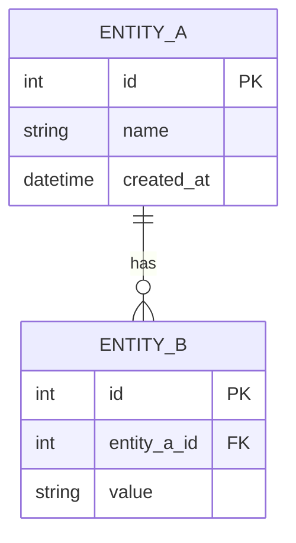

## Overview

{{ERD description}}

## Diagram

## Table Descriptions

### ENTITY_A

| Column | Type | Description |
|--------|------|-------------|
| id | INT | PK, Auto Increment |
| name | VARCHAR(100) | Name |
| created_at | DATETIME | Created at |

### ENTITY_B

| Column | Type | Description |
|--------|------|-------------|
| id | INT | PK, Auto Increment |
| entity_a_id | INT | FK → ENTITY_A.id |
| value | VARCHAR(255) | Value |

## Change History

| Version | Date | Changes | Author |
|---------|------|---------|--------|
| 1.0.0 | {{date}} | Initial revision | {{author}} |
