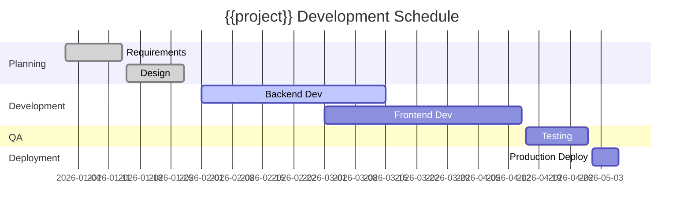

## Schedule

## Milestones

| Milestone | Target | Status | Notes |
|-----------|--------|--------|-------|
| Planning Done | 2026-01-28 | ✅ Done | |
| Dev Done | 2026-04-15 | 🔄 In Progress | |
| QA Done | 2026-04-30 | ⏳ Pending | |
| Release | 2026-05-07 | ⏳ Pending | |

## Task List

| ID | Task | Assignee | Start | End | Status |
|----|------|----------|-------|-----|--------|
| T-001 | Requirements | {{assignee}} | 2026-01-01 | 2026-01-14 | Done |
| T-002 | Design | {{assignee}} | 2026-01-15 | 2026-01-28 | Done |
| T-003 | Backend Dev | {{assignee}} | 2026-02-01 | 2026-03-15 | In Progress |
| T-004 | Frontend Dev | {{assignee}} | 2026-03-01 | 2026-04-15 | Pending |

## Change History

| Version | Date | Changes | Author |
|---------|------|---------|--------|
| 1.0.0 | {{date}} | Initial revision | {{author}} |
