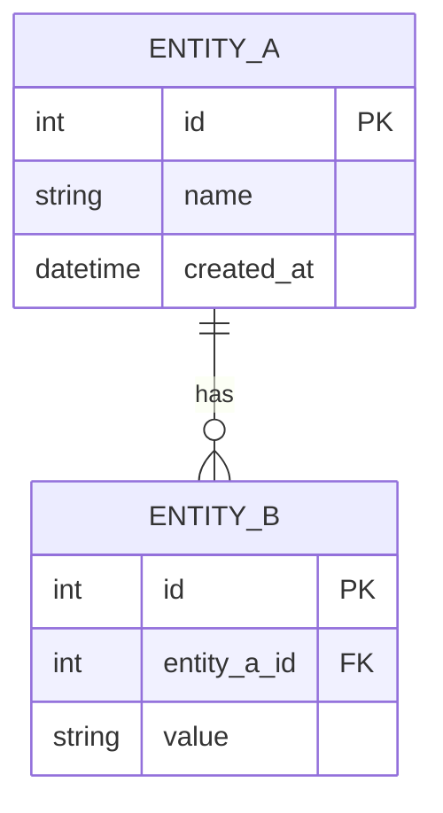

## 개요

{{ERD 설명}}

## 다이어그램

## 테이블 설명

### ENTITY_A

| 컬럼 | 타입 | 설명 |
|------|------|------|
| id | INT | PK, Auto Increment |
| name | VARCHAR(100) | 이름 |
| created_at | DATETIME | 생성일시 |

### ENTITY_B

| 컬럼 | 타입 | 설명 |
|------|------|------|
| id | INT | PK, Auto Increment |
| entity_a_id | INT | FK → ENTITY_A.id |
| value | VARCHAR(255) | 값 |

## 변경 이력

| 버전 | 날짜 | 변경 내용 | 작성자 |
|------|------|---------|-------|
| 1.0.0 | {{날짜}} | 최초 작성 | {{작성자}} |
