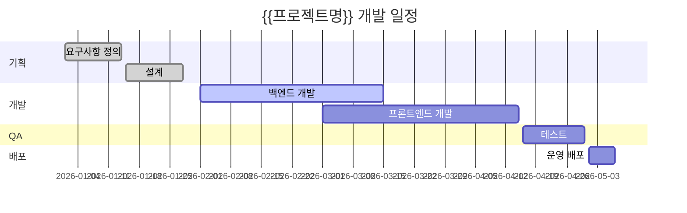

## 전체 일정

## 마일스톤

| 마일스톤 | 목표일 | 상태 | 비고 |
|---------|-------|------|------|
| 기획 완료 | 2026-01-28 | ✅ 완료 | |
| 개발 완료 | 2026-04-15 | 🔄 진행중 | |
| QA 완료 | 2026-04-30 | ⏳ 대기 | |
| 출시 | 2026-05-07 | ⏳ 대기 | |

## 태스크 목록

| ID | 태스크 | 담당자 | 시작일 | 종료일 | 상태 |
|----|--------|-------|-------|-------|------|
| T-001 | 요구사항 정의 | {{담당자}} | 2026-01-01 | 2026-01-14 | 완료 |
| T-002 | 설계 | {{담당자}} | 2026-01-15 | 2026-01-28 | 완료 |
| T-003 | 백엔드 개발 | {{담당자}} | 2026-02-01 | 2026-03-15 | 진행중 |
| T-004 | 프론트엔드 개발 | {{담당자}} | 2026-03-01 | 2026-04-15 | 대기 |

## 변경 이력

| 버전 | 날짜 | 변경 내용 | 작성자 |
|------|------|---------|-------|
| 1.0.0 | {{날짜}} | 최초 작성 | {{작성자}} |
